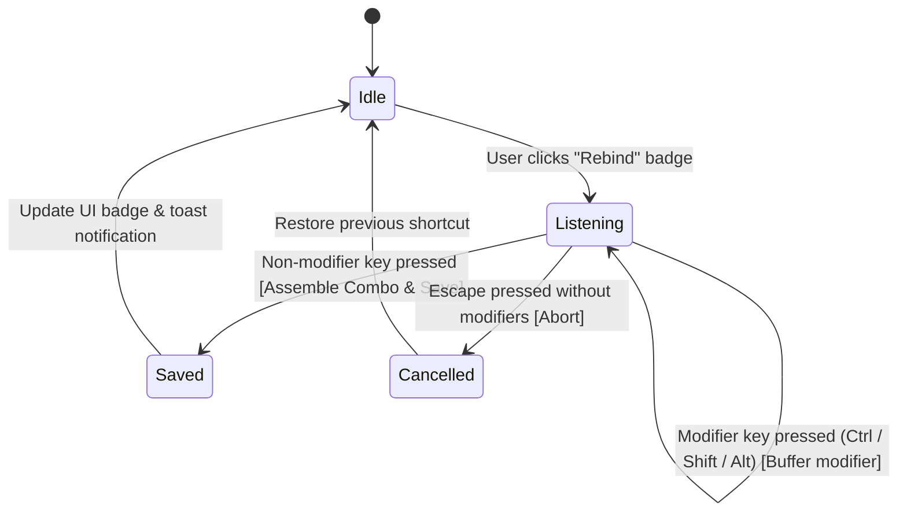

# Keyboard Shortcuts & Keybinding Combos System — PRD
**Product:** NBPDCL SaaS Billing Platform  
**Module:** Keyboard Shortcuts & Review Workflow Engine  
**Version:** 1.0  
**Status:** Approved for Backlog / Ready for Implementation on Command  
**Author:** AI Engineering & Architecture Team  
**Depends on:** User Management, Admin Settings System, Dashboard Consumer Card Review  
**Location:** `.agent/docs/prd/07-Keyboard_Shortcuts_System_PRD.md`

---

## 1. Executive Summary & Purpose

The NBPDCL Meter Billing platform is engineered for high-velocity consumer account auditing. Billing operators process thousands of consumer records per MRU cycle. The goal of this system is to enable **100% hands-on-keyboard auditing**, allowing operators to verify readings, submit bills, flag doubts/critical issues, and navigate cards at maximum throughput without reaching for a mouse.

### Problem Statement
The legacy implementation only supported **single raw key codes** (e.g. `c`, `r`, `m`, `2`, `3`, `Space`, `Enter`). It failed when attempting to bind **multi-key combinations** (e.g. `Ctrl+C`, `Shift+M`, `Alt+1`, `Ctrl+Shift+Enter`):
1. **Premature Keydown Capture**: The rebinding listener captured the initial modifier key (`Control`, `Shift`, `Alt`) on the first `keydown` event and halted before the companion key was struck.
2. **Missing Modifier Matcher**: The navigation runtime (`onKeyNav`) only checked `e.key` without checking modifier state flags (`e.ctrlKey`, `e.shiftKey`, `e.altKey`, `e.metaKey`), causing false-positive collisions (e.g. browser copy `Ctrl+C` triggering single-key `c` action).

### Solution Vision
Upgrade the shortcut engine to universally support **both single keys AND multi-key combinations**, with smart modifier buffering, cross-platform normalization, conflict warnings, and input-field isolation.

---

## 2. Core Principles

```
1. Operator Freedom: Any action can be mapped to either a Single Key (e.g. "c") or a Key Combo (e.g. "Ctrl+C").
2. No Accidental Triggers: Single-key actions must never fire when modifier keys (Ctrl/Alt/Cmd) are pressed.
3. Input Box Safety: While typing inside working reading inputs or remark boxes, single-character navigation keys are disabled to prevent corruption of data.
4. Layered Configuration Hierarchy: Factory Config -> Admin Global Default -> User Custom Override.
5. Zero DB Migration Overhead: All key combinations are stored as clean normalized strings (max 30 chars) in the existing JSON storage.
```

---

## 3. Standard Action Inventory

The system governs 10 standard audit and navigation actions:

| Action Identifier | Default Key | Suggested Combo | Action Description | Target Context |
|---|---|---|---|---|
| `copy_ca` | `c` | `Ctrl+C` | Copies active consumer CA number to clipboard | Card Review |
| `focus_reading` | `r` | `Alt+R` | Focuses and selects the Working Reading input box | Card Review |
| `auto_fill_reading` | `a` | `Alt+A` | Auto-fills reading with `Prev Reading + Smart Avg` | Card Review |
| `submit_ok` | `Enter` | `Ctrl+Enter` | Saves bill as Submit / OK and auto-advances | Card Review |
| `mark_doubt` | `2` | `Alt+2` | Flags bill as Doubt / Re-check | Card Review |
| `mark_critical` | `3` | `Alt+3` | Flags bill as Critical / Issue | Card Review |
| `next_card` | `ArrowDown` | `Alt+Down` | Navigates to the next consumer card | Card Review |
| `prev_card` | `ArrowUp` | `Alt+Up` | Navigates to the previous consumer card | Card Review |
| `open_remark` | `m` | `Alt+M` | Opens and focuses the Remark note textarea | Card Review |
| `exit_box` | `Escape` | `Escape` | Unfocuses input box, returning to review navigation | Input Editing |

---

## 4. Key Combination Grammar & Normalization

All shortcuts must be recorded and parsed in a canonical format:

### 4.1 Canonical Format
```
[Ctrl+][Alt+][Shift+][Meta+]<MainKey>
```
*Modifiers always follow the strict order: `Ctrl` → `Alt` → `Shift` → `Meta`.*

### 4.2 Key Normalization Rules
1. **Letters**: Stored in uppercase when paired with modifiers (`Ctrl+C`, `Shift+M`) or single characters (`c`, `m`).
2. **Special Keys**: Named explicitly (`Space`, `Enter`, `Escape`, `Tab`, `Backspace`, `Delete`, `ArrowUp`, `ArrowDown`, `ArrowLeft`, `ArrowRight`, `Home`, `End`, `PageUp`, `PageDown`, `F1`–`F12`).
3. **Numbers & Symbols**: `0`–`9`, `+`, `-`, `=`, `[`, `]`, `;`, `'`, `,`, `.`, `/`.
4. **Whitespace**: `e.key === ' '` is normalized to `Space`.
5. **Platform Meta**: Windows key / Mac Command (`metaKey`) is mapped to `Ctrl` by default for cross-platform consistency, or `Cmd` on macOS environments.

---

## 5. Smart Rebinding & Capture Engine

### 5.1 Rebinding Flow State Machine



### 5.2 Capture Logic Specification
1. **Modifier Buffering**: When `keydown` fires with `key` in `['Control', 'Shift', 'Alt', 'Meta']`, the listener does **not** close. It updates the live indicator to show active modifiers (e.g. `Ctrl + ...`).
2. **Terminal Key Press**: When a non-modifier key is pressed:
   - Collect active modifiers: `e.ctrlKey`, `e.altKey`, `e.shiftKey`, `e.metaKey`.
   - Combine with `keyName`.
   - Store formatted string (e.g. `Ctrl+Shift+D`).
   - Clean up event listener and emit success toast.
3. **Cancellation**: Pressing standalone `Escape` cancels rebinding without altering the existing keybinding.

---

## 6. Runtime Key Execution & Matching (`onKeyNav`)

### 6.1 Matching Algorithm
For every `keydown` event on the window:
1. Ignore if user is currently rebinding or if an interactive modal popup is open (`showShortcutsModal`, `showCreateMruModal`, `showPdfViewerModal`).
2. Construct the current event's dynamic combo string `currentCombo = getEventKeyCombo(e)`.
3. Normalize both `currentCombo` and `targetShortcut` (`toLowerCase()` with spaces stripped).
4. Perform exact equality check:
   $$\text{isMatch} = \left(\text{norm}(currentCombo) == \text{norm}(targetShortcut)\right)$$

### 6.2 Input Field Safety Matrix
| Current Focus Element | Key / Combo Pressed | Behavior |
|---|---|---|
| Regular Card Navigation | Single Key (`c`, `r`, `m`, `2`, `3`) | Executes Card Action |
| Regular Card Navigation | Multi-Key Combo (`Ctrl+C`, `Alt+1`) | Executes Card Action |
| Input / Textarea Field | Single Key (`c`, `r`, `m`, `2`, `3`) | **Suppressed** (Types character into text box) |
| Input / Textarea Field | `Escape` / Configured `exit_box` | **Blur / Exit** input box, re-enables card navigation |
| Textarea Field (Remark) | `Ctrl+Enter` / `Cmd+Enter` | **Save & Exit** remark, auto-submits change |

---

## 7. Storage, Configuration & Hierarchy

### 7.1 Hierarchy Resolution
```
1. User Custom Setting ($user->shortcuts[$action])
   └── If null/unset:
2. Admin System Default (SystemSetting::get('shortcuts_default')[$action])
   └── If null/unset:
3. Factory Configuration (config('shortcuts.default')[$action])
```

### 7.2 Database Schema
Stored in `users.shortcuts` as JSON:
```json
{
  "copy_ca": "Ctrl+C",
  "focus_reading": "r",
  "auto_fill_reading": "Alt+A",
  "submit_ok": "Ctrl+Enter",
  "mark_doubt": "2",
  "mark_critical": "3",
  "next_card": "ArrowDown",
  "prev_card": "ArrowUp",
  "open_remark": "Shift+M",
  "exit_box": "Escape"
}
```

### 7.3 API Endpoints
* `GET  /user/shortcuts` — Returns active merged shortcut map, labels, and defaults.
* `POST /user/shortcuts` — Validates and saves custom user shortcuts (each string `max:30`).
* `POST /user/shortcuts/reset` — Resets user overrides back to system defaults.
* `GET  /admin/shortcuts` — Admin interface for system-wide defaults.
* `POST /admin/shortcuts` — Updates system-wide default bindings for all users on defaults.
* `POST /admin/shortcuts/reset-factory` — Restores factory defaults.
* `POST /admin/shortcuts/reset-all-users` — Wipes custom overrides across all users.

---

## 8. UI & UX Design Requirements

1. **Visual Key Badges**: Multi-key combinations rendered with distinct styling:
   - Single: `<kbd>C</kbd>`
   - Combo: `<kbd>Ctrl</kbd> + <kbd>C</kbd>` or `<kbd>Shift</kbd> + <kbd>M</kbd>`
2. **Rebind Prompt Indicator**: Dynamic status banner:
   - When idle: `Click badge to rebind`
   - When holding modifier: `Press key to complete combo: Ctrl + [ ... ]`
3. **Conflict Detection Banner**: Warn user in real-time if two actions are assigned the exact same combination (e.g. `⚠️ "Ctrl+C" is also assigned to Copy CA`).
4. **Card Action Tooltips**: Hovering over card buttons displays the active shortcut hotkey badge.

---

## 9. Verification & Test Strategy

### Automated Tests
1. **`UserShortcutValidationTest`**:
   - Accepts valid single keys (`c`, `Enter`, `Space`, `ArrowDown`).
   - Accepts valid combinations (`Ctrl+C`, `Shift+M`, `Alt+1`, `Ctrl+Shift+D`, `Ctrl+Enter`).
   - Rejects strings exceeding length limit (`> 30 chars`) or malicious payloads.
2. **`ShortcutHierarchyTest`**:
   - Verifies fallback from user custom $\rightarrow$ admin system default $\rightarrow$ factory config.
   - Verifies admin reset actions (`reset-all-users`, `reset-factory`).

### GUI & Browser Tests
1. **Rebind Interaction**: Test clicking rebind, pressing `Ctrl+C`, verifying badge updates to `Ctrl + C`, and saving.
2. **Live Execution**:
   - Pressing `Ctrl+C` on card copies CA to clipboard.
   - Pressing `c` alone does not trigger `Ctrl+C` action.
   - Pressing `Shift+M` opens Remark.
   - Typing `c` or `m` inside input box does not trigger navigation or status change.
   - Pressing `Escape` exits input field.

---

## 10. Implementation Status & Next Steps

* [x] **PRD Document Created**: Stored in `.agent/docs/prd/07-Keyboard_Shortcuts_System_PRD.md`
* [ ] **Implementation Phase**: On hold until user directive (`when - say you then you have to implement`).