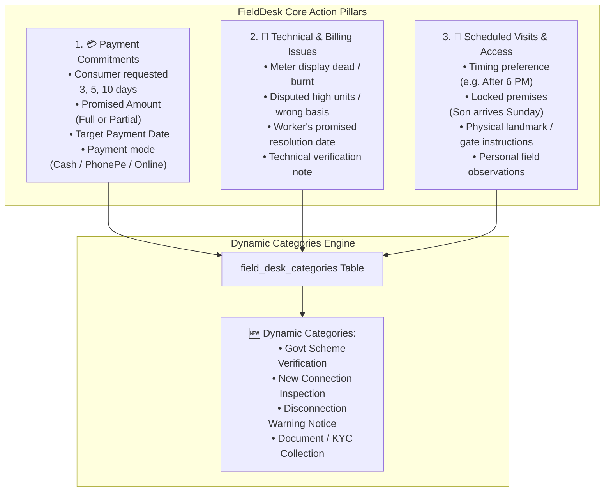
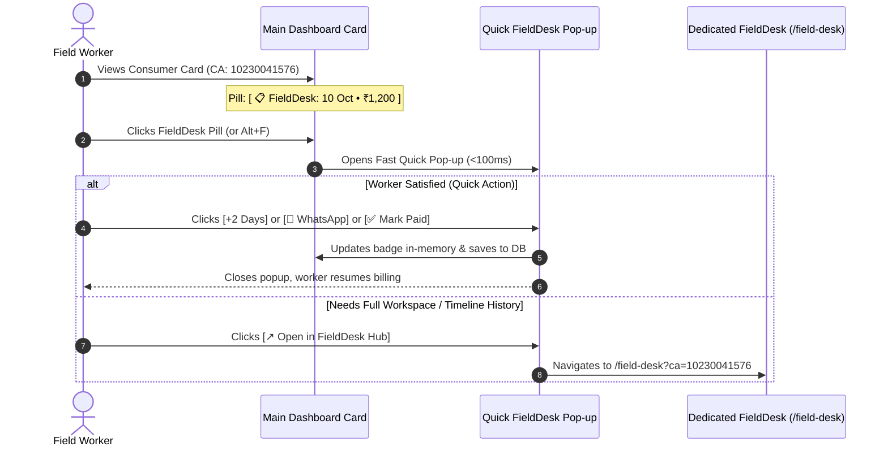

# FieldDesk — Field Operations & Consumer Action Hub — PRD
**Product:** NBPDCL SaaS Meter Billing & Field Automation Platform  
**Module:** FieldDesk (Consumer Actions, Grievance Tracking & Field Follow-Up Service)  
**Version:** 1.0.0 (Production Grade & Future-Proof)  
**Status:** Approved for Development  
**Author:** AI Engineering & Architecture Team  
**Serial Number:** PRD-11  
**Location:** `.agents/docs/prd/11-FieldDesk_System_PRD.md`  
**Route:** `/field-desk`  
**Depends On:** `ConsumerAccount`, `BillRecord`, `Mru`, `DashboardController`, `UserManagement`  

---

## 1. Executive Summary & Brand Identity

**FieldDesk** is a specialized, high-velocity field management and revenue recovery service built natively into the NBPDCL SaaS Billing platform. 

It transforms how electricity meter readers, collection agents, and sub-division operators handle ground reality operations across Bihar (NBPDCL / BSPHCL). Instead of relying on paper notebooks, forgotten mental promises, or disjointed WhatsApp notes, field workers manage all consumer-facing commitments inside **FieldDesk**.

### 1.1 The Core Field Problem FieldDesk Solves
1. **Uncollected Revenue & Forgotten Promises**: Field workers handle 500 to 2,000+ consumer accounts. When a consumer promises to pay after 4 days upon salary credit, FieldDesk ensures that revenue collection promise is never lost.
2. **Accountability for Consumer Grievances**: When an agent promises a consumer that a burnt meter or disputed bill will be checked by a specific date, FieldDesk tracks that commitment to completion.
3. **Optimized Field Visits**: When premises are locked during the day, FieldDesk schedules specific evening or Sunday visits with exact landmarks and access notes.

### 1.2 The Two-Tier Architecture
- **Tier 1 (Dedicated Workspace: `/field-desk`)**: A full-screen operations command center for planning field routes, reviewing today's agenda, sending 1-click WhatsApp alerts, making calls, and managing action items across MRUs.
- **Tier 2 (Main Dashboard Bridge)**: A lightweight, zero-impact card bridge on the main billing dashboard (`/dashboard`). A compact badge `[ 📋 FieldDesk ]` on the card opens a **Fast Quick Pop-up** for 2-tap actions. If full history or complex editing is needed, a 1-click button jumps straight to the consumer inside FieldDesk.

---

## 2. Core Architectural Principles

```
1. Operator Freedom & Speed: Built for an agent standing on a village road with a phone. Every primary action takes 1 or 2 taps max.
2. Zero Main Dashboard Bloat: Billing cards maintain identical dimensions. Heavy agendas and timelines live exclusively in FieldDesk.
3. Month-Cycle Independence: FieldDesk actions belong to the Consumer Account, NOT just a single month's bill cycle. Commitments made in October survive into November.
4. Human Sovereignty: FieldDesk empowers the human worker; it never closes or overrides commitments without human verification.
5. Dynamic Category Extensibility: Action categories (Payment Promise, Meter Issue, Scheduled Visit) are dynamic and database-driven.
6. Tenant Isolation & Real Data Protection: All records are strictly scoped to Auth::id(). Real migrated billing records remain completely shielded.
```

---

## 3. The 3 Core FieldDesk Action Pillars



### Default FieldDesk Categories

| Category Code | Display Name | Icon | Theme Color | Priority | Primary Field Data Captured |
|---|---|---|---|---|---|
| `payment_promise` | Payment Commitment | 💳 | Emerald (`#10b981`) | High | Promised Amount, Target Date, Payment Mode |
| `issue_correction` | Technical / Grievance | 🔧 | Amber (`#f59e0b`) | Urgent | Defect Type, Resolution Target Date, Grievance Note |
| `scheduled_visit` | Scheduled Visit | 🚶 | Indigo (`#6366f1`) | Normal | Visit Date, Time Slot, Access Note, Landmark |
| `general_note` | Field Dossier Note | 📝 | Slate (`#64748b`) | Low | Permanent Consumer Note, Family Contact |

---

## 4. Two-Tier Workspace Architecture

### 4.1 Tier 1: Dedicated FieldDesk Workspace (`/field-desk`)

```
┌──────────────────────────────────────────────────────────────────────────────┐
│  ⚡ FieldDesk — Operations Command Center                  [+ New Action]    │
├──────────────┬──────────────┬──────────────┬──────────────┬──────────────────┤
│ 🚨 Due Today │ ⚠️ Overdue   │ 📅 Upcoming  │ ✅ Resolved  │ 📊 Total Active  │
│      8       │      3       │      14      │  45 (Month)  │        25        │
├──────────────┴──────────────┴──────────────┴──────────────┴──────────────────┤
│ Filters: [Category: All ▾] [MRU: All ▾] [Priority ▾] [Search: CA/Name/Note] │
├──────────────────────────────────────────────────────────────────────────────┤
│ 💳 CA: 10230041576 • Ram Kumar • Ward 4, Basalgaon                           │
│    📅 Target: Today (10 Oct 2026) • Promised: ₹1,200 (Total Bill: ₹3,450)    │
│    📝 "PhonePe: 9876543210 • Salary credited on 10th • 2nd house from pond"  │
│    🔄 Rescheduled: 1 time (Orig: 06 Oct) • Priority: High                    │
│    Actions: [💬 WhatsApp] [📞 Call] [+2 Days] [+5 Days] [✅ Mark Paid] [✏️]  │
├──────────────────────────────────────────────────────────────────────────────┤
│ 🔧 CA: 10230058472 • Sita Devi • Ward 2, Hala                                │
│    📅 Target: 12 Oct 2026 • Meter Issue Resolution                           │
│    📝 "Display blank. Report #412 submitted to JE. Replacement promised."   │
│    Actions: [💬 WhatsApp] [📞 Call] [+2 Days] [+5 Days] [✅ Resolved] [✏️]   │
└──────────────────────────────────────────────────────────────────────────────┘
```

#### FieldDesk Workspace Capabilities:
1. **Morning Action Summary**: Reactive KPI cards show Due Today, Overdue, Upcoming, and Resolved counts.
2. **2-Tap Fast Rescheduling**: Quick buttons (`[+2 Days]`, `[+5 Days]`, `[+7 Days]`) push dates forward in 1 tap without forms.
3. **1-Click WhatsApp & Call**: Direct WhatsApp trigger (`wa.me`) with pre-filled localized Hindi/Hinglish message, and direct phone call trigger (`tel:`).
4. **Interaction Timeline Drawer**: Slide-out timeline shows complete touch history (Created $\rightarrow$ Rescheduled $\rightarrow$ WhatsApp Sent $\rightarrow$ Resolved).
5. **Multi-MRU Filtering & Search**: Instant filter by MRU village block, category, or note keywords.

---

### 4.2 Tier 2: Main Dashboard Bridge (Card-Level Quick Pop-up)

On the existing Billing Dashboard (`/dashboard`):



#### Card Badge Specifications:
- **Zero Card Size Disruption**: Embedded into the header metadata row alongside the CA number and mobile pill.
- **Dynamic Badge States**:
  - *No Action*: Subtle button `[ 📋 +FieldDesk ]` (or appears on hover).
  - *Upcoming (Next 3–7 Days)*: Amber pill `[ 📋 15 Oct • ₹1,200 ]`.
  - *Due Today*: Bold Crimson pill `[ 🚨 Today • ₹1,200 ]`.
  - *Overdue*: Flashing Warning pill `[ ⚠️ Overdue (3d) • ₹1,200 ]`.
  - *Issue Pending*: Orange pill `[ 🔧 Issue: 12 Oct ]`.

#### Quick Pop-up Modal Contents:
1. Header: CA number, Consumer Name, Village/MRU.
2. Active Status: Category badge, Target Date, Promised Amount vs Total Bill.
3. Field Note: Displays existing note with 1-click inline edit.
4. Quick Buttons:
   - `[💬 WhatsApp]`
   - `[📞 Call]`
   - `[+2 Days]`
   - `[✅ Mark Done]`
5. Primary Bridge: **`[↗ Open in FieldDesk Hub]`** button linking to the dedicated management page.

---

## 5. Database Schema & Architecture

```mermaid
erDiagram
    USERS ||--o{ FIELD_DESK_ACTIONS : "owns"
    FIELD_DESK_CATEGORIES ||--o{ FIELD_DESK_ACTIONS : "categorizes"
    CONSUMER_ACCOUNTS ||--o{ FIELD_DESK_ACTIONS : "associated with"
    FIELD_DESK_ACTIONS ||--o{ FIELD_DESK_ACTIVITIES : "tracks timeline"

    FIELD_DESK_CATEGORIES {
        bigint id PK
        string name
        string code UK
        string icon
        string color
        text description
        boolean is_system
        boolean is_active
        int sort_order
        timestamps created_at_updated_at
    }

    FIELD_DESK_ACTIONS {
        bigint id PK
        bigint user_id FK
        string ca_number
        bigint consumer_account_id FK_nullable
        bigint category_id FK
        string priority "urgent | high | normal | low"
        date target_date
        date original_target_date
        decimal target_amount_nullable
        decimal collected_amount_nullable
        string payment_mode_nullable "cash | upi_phonepe | online | office"
        text private_note_nullable
        string status "open | completed | rescheduled | cancelled"
        int reschedule_count
        int billing_month_nullable
        int billing_year_nullable
        bigint mru_id_nullable
        timestamp resolved_at_nullable
        text resolution_note_nullable
        timestamps created_at_updated_at
    }

    FIELD_DESK_ACTIVITIES {
        bigint id PK
        bigint action_id FK
        bigint user_id FK
        string action_type "created | rescheduled | note_updated | whatsapp_sent | call_made | amount_collected | status_changed"
        text note_nullable
        date old_date_nullable
        date new_date_nullable
        decimal amount_recorded_nullable
        json metadata_nullable
        timestamp created_at
    }
```

---

## 6. Communication Engine & Localized Templates

Direct WhatsApp (`wa.me`) integration with zero API costs:

### 6.1 WhatsApp URL Format
```
https://wa.me/91{sanitizedMobile}?text={urlEncodedMessage}
```

### 6.2 Templates:
- **Payment Commitment**:
  > *"Namaskar {consumer_name} ji, aapke NBPDCL bijli bill (CA: {ca_number}) ka payment ₹{amount} aaj ({date}) ko scheduled tha. Kripya payment ready rakhein ya online pay karein: https://nbpdcl.co.in. Dhanyawad. — {worker_name}"*
- **Technical Grievance**:
  > *"Namaskar {consumer_name} ji, aapke bijli connection (CA: {ca_number}) ke issue ke sambandh me hamara follow-up scheduled hai. Target date: {date}. Kripya update ke liye sampark karein. — {worker_name}"*
- **Scheduled Visit**:
  > *"Namaskar {consumer_name} ji, aapke premise (CA: {ca_number}) par bijli bill inspection ke liye hum {date} ko aane wale hain. Kripya uplabdh rahein. — {worker_name}"*

---

## 7. Execution Roadmap for Implementation

| Phase | Description | Deliverables |
|---|---|---|
| **Phase 1** | Database Layer & Seeders | Migrations (`field_desk_categories`, `field_desk_actions`, `field_desk_activities`), Models, and Category Seeder |
| **Phase 2** | Service & Backend API | `FieldDeskService` & `FieldDeskController` with filtered feed, reschedule engine, and completion logic |
| **Phase 3** | Dedicated FieldDesk UI | Route `/field-desk`, Blade view `resources/views/field-desk/index.blade.php`, Alpine.js reactive app |
| **Phase 4** | Main Dashboard Bridge | Card badge indicator, quick modal `showFieldDeskModal`, shortcut (`Alt+F`), and `/field-desk` deep-link |
---

## 8. Zero-API GPS Geolocation & Consumer Contact Management

### 8.1 Zero-API Hardware Satellite Geolocation
* **No Third-Party Paid API Keys**: Uses native browser HTML5 `navigator.geolocation` with hardware satellite parameters: `{ enableHighAccuracy: true, timeout: 15000, maximumAge: 0 }`.
* **On-Demand Capture Invariant**: GPS is never polled automatically on modal load to save device battery and prevent accidental office/road tagging. Staff must click `[ 📍 Capture Current Position ]` on-site.
* **Accuracy Tiers**:
  * `accuracy <= 10m`: `🟢 High Precision (±Xm)` (sub-10m target met)
  * `10m < accuracy <= 25m`: `🟡 Good Accuracy (±Xm)`
  * `accuracy > 25m`: `🟠 Moderate Accuracy (±Xm)`
* **Dual-Layer Storage**: Saved to `field_desk_actions` (action-level position) and synced to `consumer_accounts` (`latitude`, `longitude`, `location_accuracy`, `location_updated_at`) via permanent toggle or dedicated endpoint `POST /api/field-desk/consumer/{ca}/contact`.
* **Deep-Link Navigation**: Standardized universal URL `https://www.google.com/maps?q={latitude},{longitude}` opens natively in Google Maps app on mobile or desktop browser with zero map quotas.

### 8.2 Consumer Mobile Integration
* Displays 10-digit mobile prominently on agenda cards and dashboard bridge.
* 1-Click native dialer via `tel:+91{mobile}`.
* 1-Click bilingual WhatsApp reminder via `wa.me/91{mobile}`.
* Inline quick add/edit tools without leaving the card or modal.

---

## 9. Current Status & Phase 1 Completion Memory

* **Phase 1 Implementation**: Fully implemented and production-verified.
* **Automated Test Coverage**: 32/32 tests passing in `tests/Feature/FieldDeskSystemTest.php` and `tests/Feature/UserDashboardTest.php`.
* **Code Quality**: Formatted with Laravel Pint (`vendor/bin/pint --format agent`).
* **Real Data Protection**: 100% compliant; User ID 9 (`shamim244d@gmail.com`) strictly untouched.
* **Ready for Next Phase**: Baseline architecture, database schema, APIs, and UI bridges are completely stable and ready for user-requested future expansions.

---
*End of PRD-11 Specification. Branded as FieldDesk.*

